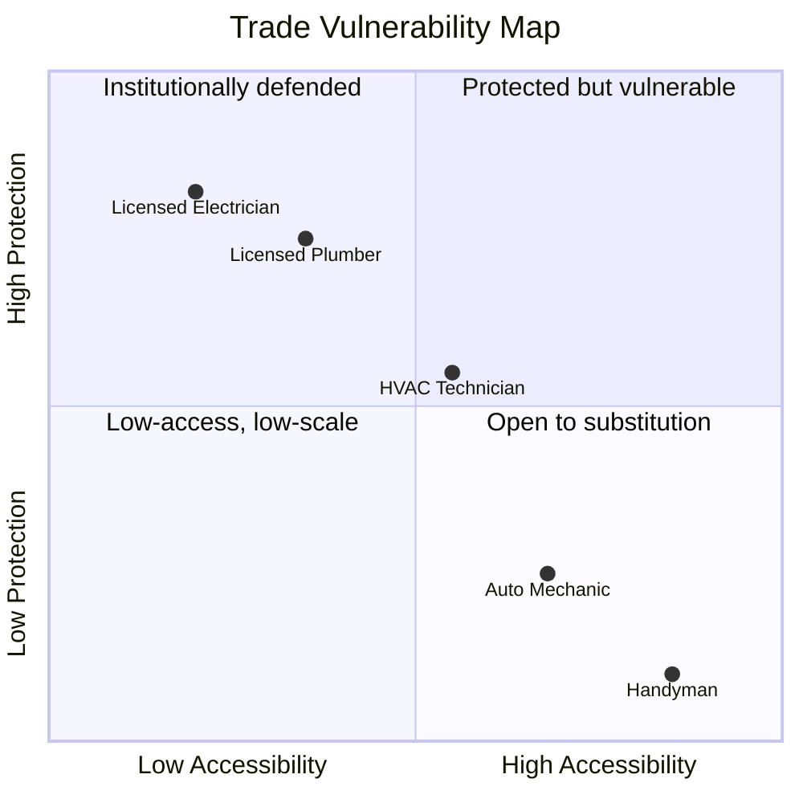

The prevailing wisdom for surviving the "AI apocalypse" has become a cliché:
> *Learn a trade.*

The logic is simple: AI can't crawl under a sink to fix a P-trap or climb a ladder to rewire a junction box. Because these jobs require physical presence and manual dexterity, the narrative suggests they are "safe." It’s a supply-side fantasy: the belief that if a job is physically difficult, it is economically protected.

It ignores the demand side of the equation - and the economic reality that is already reshaping the trades from two directions.

## The Pressure Map

Every trade sits somewhere on a map defined by two axes:

- **Accessibility:** How easily can this work be performed without a full-stack professional? This includes both knowledge ("can I learn this from a tutorial?") and structural simplicity ("can this be broken into smaller, less-skilled steps?").
- **Protection:** How much legal, regulatory, and institutional infrastructure shields this profession? Licensing requirements, code inspections, insurance mandates, liability frameworks.

Rising economic pressure, collapsing knowledge barriers, expanding material access, and growing political frustration all push in the same direction. They push trades *right* along the accessibility axis and *down* along the protection axis. Not independently. Simultaneously. And the compound effect is what matters.

A trade's position on this map isn't static. It's a snapshot of a thing in motion. And the motion has a destination: the bottom-right corner - high accessibility, low protection - is the event horizon of this argument. More occupations are being pulled toward it than most people want to admit. The only question is how fast.

## The Consumer Front

At the household level, whether someone hires a professional or does it themselves comes down to four forces:

- **Capability:** Can they physically and intellectually perform the work? Are they legally permitted to? Does that matter to them?
- **Time:** Do they have the time to execute, and the time to spare?
- **Cost:** What money is available, what does the work cost to execute - and what's the economic risk if it goes wrong? How much of that risk are they willing to absorb?
- **Resources:** How readily available are the tools, materials, and space needed to do the job?

These are the axes of the consumer substitution decision. They aren't static - they shift with circumstance, and they vary from person to person. Someone with high capability but no resources lands in a different place than someone with deep pockets but no time. Someone who doesn't care about code compliance calculates differently than someone who does.

And critically, these forces interact. Accessible knowledge makes time more productive. Economic pressure makes time more available. Available resources make capability more actionable. When they align in the same direction - when someone has more time than money, knowledge is freely available, and materials are a hardware-store trip away - the compound effect pushes hard toward doing it yourself. When they don't align, the professional stays in the picture longer.

Mechanics are the canary. Auto repair has relatively few legal restrictions - you can legally do almost anything to your own car. That makes it especially exposed when the forces align against hiring a professional - cost is high, capability is reachable, time is available, resources are accessible. People take the wrench into their own hands. Or they just don't fix things at all.

### The Industrial Front: The Actuarial Pivot

The "Learn a Trade" crowd imagines a humanoid robot navigating a muddy construction site. They’re right to scoff: that’s a hard problem, and one we’re not likely to solve at scale rapidly. But industrial firms won't simply rely on smarter robots - they **build dumber sites.**

At the scale of a data center developer or a hospital chain, the goal is determinism. Human intervention is a "variable" that creates risk. The trade isn't being replaced by an android - it’s being replaced by **The Lego-fication of Infrastructure.**

When a pre-fabricated electrical room arrives on a flatbed, it is bench-tested, factory-certified, and shrink-wrapped. To an insurance actuary, that "product" is a known quantity. To that same actuary, twenty electricians bending conduit on-site for six months is a **six-month liability window** filled with potential litigation, worker’s comp claims, and manual errors.

The shift isn't just about efficiency, it's about insurability. Once factory-certified systems reach a certain threshold of reliability, the "field-built" installation stops being a craft - it becomes an unnecessary insurance penalty. The firm doesn't have to lobby to remove the electrician; the insurer simply makes it too expensive to hire one.

### The Labor Density Collapse

The trade isn't "gone," but the **labor density** has collapsed. If a project that once required 10,000 on-site man-hours now requires 800 because the complexity was "baked into" the product at the factory, the "Learn a Trade" advice fails the math test.

The site is "resilient" in the sense that a human still needs to be there to guide the crane and bolt the skid down. But you don't need a middle class of 50,000 tradespeople to do that. You need a few operators and a very expensive insurance policy.

## The Remaining Constraints

As economic pressure rises, many frictions become negotiable: convenience, caution, quality thresholds, and the willingness to DIY all compress. What remains most durable are two categories of constraint:
- Physical capability: whether a person can actually perform the work with their body, tools, space, and stamina.
- Legal recognition: whether institutions will treat the work as valid for permitting, insurance, resale, financing, or compliance.

Most of the narrower objections people raise - tools, workspace, liability, inspections, insurance - ultimately fold into one of those categories.

Real-world frictions do slow this movement. Legacy infrastructure resists standardization - a 100-year-old house with mismatched piping and previous DIY "fixes" is a harder problem than a new build. Private insurers act as shadow regulators, refusing to underwrite work that wasn't performed by a credentialed professional regardless of what the law allows. Specialized tooling creates capital barriers that tutorials can't solve. These are real, but they describe where trades sit on the pressure map and how fast they move - not whether they move.

## The Regulatory Moat

This leads to the core of the argument: **The durability of a trade is a political question, not a technical one.**

Electricians aren't safer than mechanics because their work is "harder." They're safer because their trade instilled a stronger norm of institutional protection - a moat of licensing, code inspections, and permits. You hire a licensed electrician not because AI can't teach you to wire a panel, but because your municipality requires a licensed signature to keep your insurance valid. In many cases, you can’t even shut down the line without involving the power company.

But the moat acts differently depending on which side of the pressure you're looking at.

For consumers, regulation prevents you from bypassing the professional. It's a wall between you and doing the work yourself.

For industry, regulation doesn't necessarily protect workers - it often protects firms that can afford compliance infrastructure, certification, documentation, and legal overhead. A regulatory moat may preserve the market without preserving the wage structure or role composition inside it. The work stays "professionalized." The jobs inside it get reorganized.

That's a critical distinction. Even in heavily regulated trades, the volume and character of work can change dramatically while the regulatory framework stays intact.

### The Shift from Laborer to Auditor

What the landscape looks like in reality is a liquidation of middle-class careers as professions shift from executors to auditors.

On the consumer side, you pay for 20 minutes of inspection because the bank requires a signature to keep your mortgage valid. On the industrial side, the skilled tradesperson becomes a systems operator, validating machine outputs and assuming legal accountability for work executed by a factory.

The *trade* still exists. The licensing requirement still exists. The regulatory moat still holds. But the volume of work inside that moat collapses. You don't need a middle class of 50,000 tradespeople anymore. You need 5,000 auditors sitting on top of a base of standardized, lower-paid execution - or no human execution at all. And even then, it's likely that no auditor is safe if all an auditor does is review and sign-off - we can make software for that.

## The Queue: The Fragility of the Gate

If your "AI-proof" career strategy relies on a regulatory moat, you aren't safe. You're just further back in the queue.

Regulation doesn’t eliminate pressure, it just concentrates it. When a licensed class is perceived as economically unreachable, the “moat” stops looking like a public safeguard and starts looking like exclusion. And when the insurance industry decides that your human hands are a liability compared to a factory-certified skid, the moat won't just leak - it will be drained from the inside.

## Final Thoughts

None of this means trade work vanishes. Pipes still leak. Electrical systems still fail. Buildings still need to be maintained. The question is not whether the work remains necessary. The question is who is forced to pay for skilled labor, under what conditions, and how much of that labor remains attached to a broad middle-class occupation rather than a narrower layer of inspection, compliance, and exception handling.

And it's worth asking what "learn a trade" actually means in that world. If liability pressure is driving firms to move judgment into the system layer - into software, sensors, and standardized workflows - then the person "learning the trade" isn't learning to exercise skilled judgment. They're learning to execute someone else's compliance checklist. The career still exists. The craft, increasingly, doesn't.
